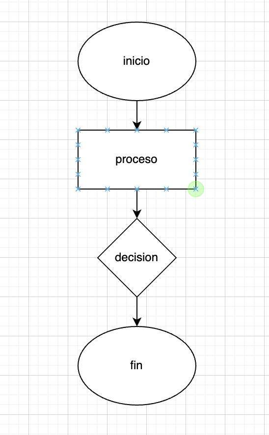
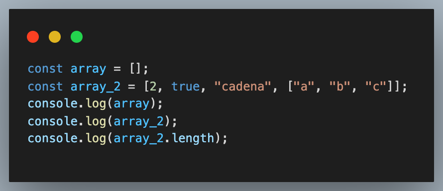
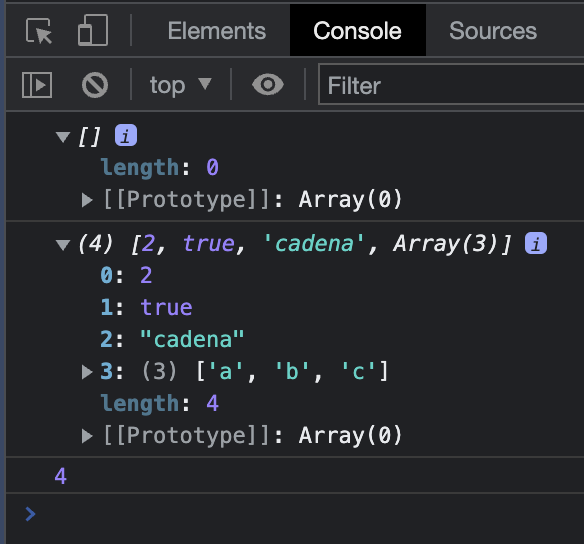
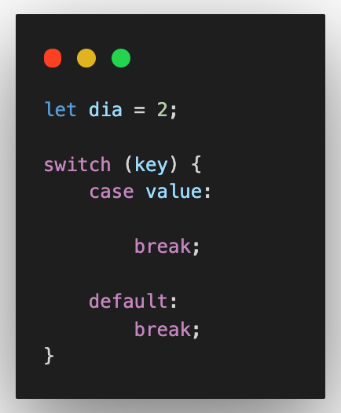
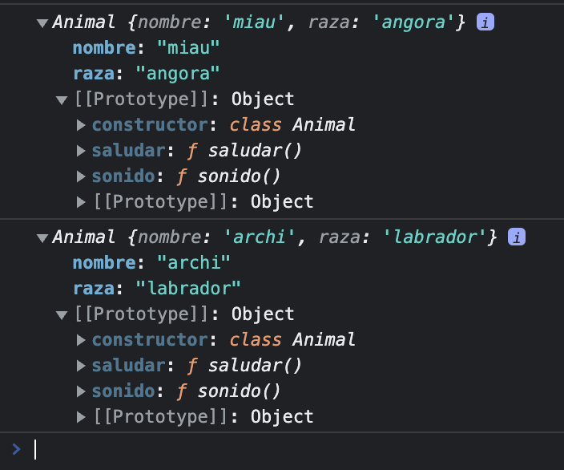

# Javascript

> JavaScript es un lenguaje de Programación orientado a objetos (POO), esto quiere decir que es capaz de interactuar, modificar los valores, a travéz de sus métodos (comportamiento). Esto nos ayuda a manipularlos, adaptarlos, y reutilizar código.

> En JavaScript el orden de código es:

1.- Importaciones de módulos.
2.- Declaraciones de variables.
3.- Declaraciones de funciones.
4.- Ejecución de código.

> Fuentes:

* Mozilla Developer Network: https://developer.mozilla.org/es/docs/Web/JavaScript

* Libro Eloquent Javascript: https://eloquentjs-es.thedojo.mx/index.html  | versión descargable: https://eloquentjs-es.thedojo.mx/Eloquent_JavaScript.pdf

* w3schools.com: https://www.w3schools.com/ | References: JavaScript


******************************************************

***Comprobar si mi archivo `script.js` está conectado con el archivo de `index.html`***


```js
console.log('conectado con html!');
```
 ### ***Concatenar:***

```js
let nameUser = "Anita";
let year = 20
let concatenar = nameUser + year
let concatenar_2 = nameUser + " " + year // algunos lenguajes de progra,ación no permiten sumar string con numbers
```

### ***Interpolación***

```js
let interpolacion = `Mi nombre es ${nameUser} y tengo ${year} años `// template string
let interpolacion_2 = `Mi nombre es ${nameUser} 
y tengo ${year} años `// detecta los espacios
```


```js
console.log(concatenar);
console.log(interpolacion);
console.log(interpolacion_2);
```

### ***Prompt()***

> Nos sirve para ingresar datos pero los ingresa como string siempre:

```js
let edadUser = parseInt(prompt("ingrese su edad")); //parseInt convierte a número los strings
console.log(edadUser); // el dato ingresado se muestra en la consola.
```

```js
console.log(typeof edadUser); // typeof nos devuelve el tipo de dato
```


### ***Operadores aritmeticos***

***Suma***

```js
let suma = 10 + 20;
console.log(suma);
```

***Resta***

```js
let resta = 20 - 10;
console.log(resta);
```

***Multiplicación***

```js
let multiplicacion = 2 * 4;
console.log(multiplicacion);
```

***División***

```js
let division = 8 / 4;
console.log(division);
```

***Resto | sobrante | módulo***

```js
let resto = 2 % 20;
console.log(resto);
```

### Diagramas de flujo | pseudocódigo




***Ejercicio guiado:***

1.- Debe devolver los resultados de las operaciones aritméticas básicas:

```js
let primerNumero = parseInt(prompt("ingresa un número"));
let segundoNumero = parseInt(prompt("ingresa otro número"));

console.log(`
Suma: ${primerNumero + segundoNumero}
Resta: ${primerNumero - segundoNumero}
Multiplicación: ${primerNumero * segundoNumero}
División: ${primerNumero / segundoNumero}
Módulo: ${primerNumero % segundoNumero}
`);
```

2.- Crear un programa que pida al usuario ingresar la temperatura en grados Celcius y que la transforme a grados Kelvin y Fahrenheit.

a considerar:

* 0 grados Celsius corresponden a 273,15 Kelvin. La fórmula para convertirlos es `0 °C + 273.15 = 273.15 K`

* 0 grados Celsius corresponden a 32 Fahrnheit. La fórmula para convertirlos es `(0 °C * 9/5) + 32 = 32 °F`


3.- Crear un programa que pida al usuari@ una cantidad de días y que le devuelva su equivalente en año, semanas y días. Por ejemplo, si el usuari@ ingresa 373, el resultado debe ser 1 año, 1 semana, y 1 día.

* considerar lo siguiente:
* 1 año tiene 365 días.
* 1 semana tiene 7 días.

* Se recomienda usar la función Math.floor para obtener la parte entera de un número decimal.

```javascript
let totalDias = parseInt(prompt("Ingrese la cantidad de días"));
let years = Math.floor(totalDias / 365);
let semanas = Math.floor((totalDias % 365) / 7);
let dias = Math.floor((totalDias % 365) % 7);

console.log(`
${years} años,
${semanas} semanas,
${dias} días
`);
```


***Números aleatorios***

```js
Fórmula:
let random = Math.floor(Math.random() * (max - min)) + min;
```

```js
let random = Math.floor(Math.random() * (20 - 5)) + 5;
console.log(random);
```

```js
// de número a string:
let numero_2 = 20;
console.log(numero_2.toString());
console.log(numero_2);
```


### Operadores relacionales:

Acá nos encontramos con algo conocido que es:

* Mayor que `>`
* Menor que `<`
* Mayor o igual `>=`
* Menor o igual `<=`
* Idéntico a `===`
* Distinto que `!==`

***Array:***

```js
let arreglo = ["manzana", "pera", "frutilla"];
```

***Ejemplos:***

```js
let resultado_1 = 20 > 10;
console.log(resultado_1); // true

let resultado_2 = 20 < 10;
console.log(resultado_2); // false

let resultado_3 = 20 === 10;
console.log(resultado_3); //false

let resultado_4 = 20 == '20';
console.log(resultado_4); // true

let resultado_5 = 20 === '20';
console.log(resultado_5); // false

let resultado_6 = 20 !== '20';
console.log(resultado_6); // true

let resultado_7 = 20 != '20';
console.log(resultado_7); // true
```


### Operadores Lógicos:

> Los operadores lógicos se ussan para combinar dos valores `booleanos` y devolver un resultado verdadero, falso o nulo. Los operadores lógicos también se denominan operadores Booleanos.

* `&&`: si dos valores son verdaderos va a devolver verdadero.
* `||`: uno de los valores debe cumplirse para que devuelva verdadero.
* `!`: se usa para la negación.


***Ejemplos:***

```js
let resp_1 = true && true;
console.log(resp_1); // true

let resp_2 = 20 > 10 && 10 < 20;
console.log(resp_2); // true

let resp_3 = true && true && false;
console.log(resp_3); // false

let resp_4 = true || false;
console.log(resp_4); // true

let resp_5 = !true;
console.log(resp_5); // false

let resp_6 = !false;
console.log(resp_6); // true
```


## Estructuras de control:

> En lenguajes de programación, las estructuras de control ***permiten modificar el flujo de ejecución de las intrucciones de un programa.***


***Condicionales***

* `if | else`: si ocure algo, haz esto, sino haz lo otro.
* `?`: operador ternario (es equivalente a `if` o `else`, método abreviado).
* `switch`: estructura para casos específicos, similar a varios `if | else` anidados.

***Repetitivas o iterativas***

* while
* do..while
* for


### ***if/else***

> Un `if` en programación se utiliza para evaluar una expresión condicional: ***si se cumple la condición(es verdadera), ejecutará un bloque de código.***

***Ejemplo:***

```js
/* ****** if | else ***** */


if (true) {
    console.log("es verdadero"); // se ejecuta ya que entra en el ciclo if
}


if (false) {
    console.log("es verdadero");
} else {
    console.log("se ejecuta solo por la condición else");
}
```


```js
let respuestaUser = prompt("¿Quieres aprender js?");

if (respuestaUser.toLocaleLowerCase() === "si") {
    console.log("wiiii!");
} else {
    console.log("que mal bro!");
}
```


## ***switch***


> La declaración `switch` evalúa una expresión, comparado el valor de esa expresión con una instancia case, y ejecuta declaraciones asociadas a ese case, así como las declaraciones en los case que siguen.


***Ejemplo de `switch`:***


```js
let escojaUnaOpcion = prompt(`
Elija una opción:
1: Libros
2: Peliculas
3: Juegos
Ingrese el número de la opción:
`)

switch(escojaUnaOpcion){
    case '1':
        console.log('El señor de los anillos');
    break; // si el usuario escoge la opción 1 sale del programa
    case '2':
        console.log('Rápidos y Furiosos');
    break;
    case '3':
        console.log('Need for speed');
    break;

    default:
        console.log('Opción no válida humano')
    break;
}
```


### ***while***

```js
let numero = 0

while(numero < 10) {
    console.log(numero)
    numero++; //necesita un incrementador(condicion de salida), es lo mismo que decir: numero = numero + 1
}

console.log(numero);
```

**************************************************

### ***Funciones***

> Functions: Las funciones son uno de los bloques fundamentales en Javascript. Una función en Javascript es similar a un procedimiento - un conjunto de ***instrcciones*** que realiza una tarea o calcula un valor, pero para que un procedimiento califique como función, debe tomar alguna entrada y devolver una salida donde hay alguna relación obvia entre entrada y salida.

> Características:
    * El nombre de la función.
    * Una lista de parámetros de la función, entre paréntesis y separados por comas.
    * Las declaraciones de Javascript que definen la función, encerradas entre llaves, `{...}`.

***Ejemplo:***

```js
function saludar(){
    console.log("Soy una function");
}

saludar();
```

***Pero si llamo a la function antes de crearla se ejecutará?***

```js
saludar();

function saludar(){
    console.log("Soy una function");
}
```

***NOTA: se ejecuta de igual manera ya que el navegador lo que hace es: elevar todas las variables en este caso funciona igual.***

> ***Hoisting: una estricta definición de hoisting sugiere que las declaraciones de variables y funciones son físicamente movidas al comienzo del código, pero esto no es lo que ocurre en realidad. Lo que sucede es que las declaraciones de variables y funciones son asignadas en memoria durante la fase de compilación, pero quedan exactamente en dónde las has escrito en el código.***


***Function con parámetro:***

```js
function saludar(nombre){ //recibe parámetros
    console.log("Soy una function " + nombre);
}

saludar("Ewi");
```

***Function con parámetro y argumento de variable con prompt()***


```js
function saludar(nombre){ //recibe parámetros
    console.log("Soy una function " + nombre);
}

let nombreUsuario = prompt("¿Cuál es tu nombre?")
saludar(nombreUsuario);
```


***Function con dos argumentos y dos parámetros***

```js
function saludar(nombre, apellido){ //recibe parámetros
    console.log(`Soy una function  ${nombre} ${apellido}`);
}

let nombreUsuario = prompt("¿Cuál es tu nombre?");
let apellidoUsuario = prompt("¿Cuál es tu apellido?");
saludar(nombreUsuario, apellidoUsuario);
```

***Function con return***

```js
function sumar(n1, n2) {
    return parseInt(n1) + parseInt(n2); // siempre return esta al final de nuestro código.
}

let numeroUno = prompt("ingresa un número");
let numeroDos = prompt("ingresa un segundo número");

console.log(sumar(numeroUno, numeroDos));
```


***Cachipún con una máquina***

> Crear un programa que le permita a una person ajugar al cachipún contra el computador, indicanco cuántas veces desea jugar o repetir el juego.

> Solución

> Considerar:
    > tijera le gana a papel
    > papel le gana a piedra
    > piedra le gana a tijera
    > si ambos jugadores eligen la misma opción es un empate.

1.- Solicitar al usuario que indique cuántas veces quiere que el programa se ejecute.

2.- Solicitar al usuario que indique su jugada (las opciones son las siguientes):

* Piedra
* Papel
* Tijera

3.- Generar una jugada automática para la máquina usando la `function` `Math.random()` de Javascript.

4.- Definir a un ganador considerando la jugada del usuario y la generada automáticamente para la máquina.

5.- Indicar el resultado de la partida dpendiento del caso:

* Felicitar al ganador en caso de ser el usuario.
* Indicar al asuario que ha perdido contra la máquina en caso de que ésta sea la que gane.
* Declarar empate (sin conflictos).

### ***Nota:Emoji en mac: control + command + espacio***


*******************************

## ***Array***

```js
let frutas = ["manzana", "pera", "naranja"];
console.log(frutas);

console.log(frutas[2]); // llamar por indice
console.log(frutas.length); //cantidad de elementos que existen dentro del array
```


***undefined***

> Una variable que no se le ha asignado valor, o no se ha declarado en absoluto (no se declara, no existe) son de tipo `undifined`. Un método o sentencia también devuelve `undifined` si la variable que se está evaluando no tiene asignado un valor. Una función devuelve `undifined` si no se ha devuelto un valor.


## ***Para las iteraciones y para todo lo demás, existe `for`***


***Ejemplo:***

* Donde `i` es el índice que hace referencia a cada elemento contenido dentro de mi array.

* El punto y coma `;` dice: evalúa este código y sigue a la siguiente sentencia.

* Va a recibir una condición de salida: si se cumple que la condición es `i < frutas.length;` el ciclo hasta que `i` solo sea menor que el el largo del arreglo, se va a ejecutar, y mostrará todos sus elementos, a no ser que necesitemos que parta de la posición `1`.


```js
for (let i = 0; i < frutas.length; i++) {
    console.log(frutas[i]);
}
```


## ***Existe una manera elegante de iterar con `for of`, pero no se escribe `for of`, veamos:

> `for of`: La sentencia for...of ejecuta un bloque de código para cada elemento de un obejeto iterable, como lo son: `string`, `array`, `objetos`, similares a array (por ejemplo, argumento or NodeList), TyoedArray, Map, Set e iterables definidos por el usuario.

> WARNING: 
    > La sintáxis de `for..fof` es específica para las colecciones, y no para todos los objetos. Esra iterará sobre cualquiera de los elementos de una colección que tenga la propiedad [`Symbol.iterador`].


* Para ello utilizamos un nombre de la variable ya existente pero en singular `frutas` a `fruta`.

* Le decimos `let fruta of frutas`, ¿qué significa esto?, que va a recorrer desde la variable en singular y va a traer los datos que existan en el array de `frutas`.


***Ejemplo:***

```js
for (let fruta of frutas) {
    console.log(fruta);
}
```


***Ejemplo de objetos iterables:***

* Esto nos imprimirá en console letra por letra.

```js
let mensaje = "no se queden dormidos";

for (let letra of mensaje) {
    console.log(letra);
}
```

* En la console podemos comprobar si es o no elemento iterable:
    * Ejemplo:
    
```js
let numero = 10;

for (num of numero) {
    console.log(num);
}
```

* Nos muestra el siguiente error:
`Uncaught TypeError: numero is not iterable`


```js
numero[Symbol.iterator]
<- undefined
```


**************************************************

## ***Variables: var v/s let v/s const:***

> `var`: Uno de los mayores problemas al declara con `var`, es que puede sobrescribir las declaraciones de variables sin errores.


***var***

```js
var estado = true;
var estado = false;

console.log(estado); // nos imprime el último valor declarado.
```


> En una aplicación pequeña, es posible que no s eencuentre con este tipo de problemas, pero cuando nuestro código crece, `puede sobrescribir` una variable que no tenía la intención de sobrescribir.

> Debido a este comportamiento no arroja un error, la búsqueda y corrección de errores se vuelve más difícil. Se introdujo `let` una nueva palabra reservada en ES6 para resolver este problema con `var`.

* ***`let`***: una variable con el mismo nombre solo se puede declarar una vez en nuestro código.

***Ejemplo***

* Nos da un error de "Uncaught SyntaxError: Identifier 'estado' has already been declared"

```js
let estado = true;
let estado = false;
console.log(estado);
```

* Pero si se puede cambiar su valor:

```js
let estado = true;
estado = false;

console.log(estado);
```


### Scope

> El `scope de una variable` hace referencia al lugar donde esta va a vivir o podrá ser accesible.

```js
var estado = true; // variable global
if (estado) {
    var estado = false;
}
console.log(estado); // false
```


> Pero que pasa si cambio var por let:

```js
let estado = true;
if (estado) {
    let estado = false;
    console.log(estado); // false, solo vive dentro del bloque de declaración
}
console.log(estado); // true, la cual fue inicializada esa variable
```

* Iteradores con `let`:


```js
for (let i = 0; i < 10; i++) {
    console.log(i); // nos imprime del 0 al 9
}
console.log(i); // nos da un error ya que `i` solo esta declarada dentro del for
```


### ***const***

> `const`: tiene todas las características de `let`, con la ventaha de que las variables declaradas usando `const` son de solo lectura. Son un valor constante, `lo que significa que una vez que se asigna una variable const`, no se puede reasignar.


***Ejemplo:***

```js
const estado = true;
estado = false;
console.log(estado);
```


```js
for (const i = 0; i < 10; i++) {
    console.log(i);
}
```


```js
const estado = true;

if(estado){
    const estado = false;
    console.log(estado); // false
}
console.log(estado); // true
```


## ***Funciones declarativas:***

```js
function numeroAzar(min, max) {
    return Math.floor(Math.random() * (max - min) + min);
}

// invocar:
console.log(numeroAzar(1, 11));
```


## ***funciones expresadas | o guardadas en una variable:***


```js
const numeroAzar = function (min, max) {
    return Math.floor(Math.random() * (max - min) + min);
}

console.log(numeroAzar(1, 10));
```

> No es lo mismo que decir: 

```js
console.log(numeroAzar(1, 10));

const numeroAzar = function (min, max) {
    return Math.floor(Math.random() * (max - min) + min);
} // nos da un error...
```

> Pasa que las `funciones expresadas`, se ejecutan en el orden que se programa, primero el navegador lee la variable y luego es ejecutada.


> La forma correcta de definir una función varia según el comportamiento que esperamos de la misma: `con las funciones declaradas, tenemos la seguridad de que siempre estarán disponibles em tiempos de ejecución`. Con las funciones `expresadas`, temdremos que éstas no son evaluadas hasta que el intérprete no alcance su posición en el código, lo cual puede generar errores en arquitecturas muy anidadas.

> El hecho de que la funciones declarativas se evalúen antes que las expresiones, pueden producir comportamientos no deseados cuando forman parte de condicionales. Para estos casos, `el uso de las funciones expresadas garantiza que éstas formarán parte del flujo general del programa`, lo cual puede evitarnos sorpresa en determinadps entornos.

***********************************************


## ***Arrow functions***


```js
const miNumeroFlecha = (min, max) => {
    return Math.floor(Math.random() * (max - min)) + min;
}
console.log(miNumeroFlecha(1, 10));
```

***Reducida:***

```js
const miNumeroFlecha = (min, max) => Math.floor(Math.random() * (max - min)) + min;
console.log(miNumeroFlecha(1, 11));
```


***omitir el `return` e intercambiarlo por paréntesis, cuando solo le pasamos un parámetro:***


> Muy a menudo lo podrás ver en `React`, omitimos el `return` y le ponemos parántesis.


```js
const miNumeroFlecha = max => (Math.floor(Math.random() * (max - 1)) + 1);
console.log(miNumeroFlecha(10));
```


## ***Ejercicio arrow functions***


> Ejercicio: Realizar un programa en JavaScript mediante el uso de funciones flechas que solicite al usuario ingresar su nombre, edad y retorne un saludo con el nombre, la edad e indicando si es mayor de edad.

***función expresada:***

```js
const edadUsuario = parseInt(prompt("Ingrese su edad"));

const verificarEdad = function (edad) {
    return edad > 17 ? "Eres mayor de edad" : "Eres menor de edad"
}
console.log(verificarEdad(edadUsuario));
```


***con if***


```js
const edadUsuario = parseInt(prompt("Ingrese su edad"));
const verificarEdad = function (edad) {
    if (edad < 18) {
        return "Eres menor de edad";
    }
    return "Eres mayor de edad";
};
```

***arrow function***

```js
const edadUsuario = parseInt(prompt("Ingrese su edad"));

const verificarEdad = edad => (edad > 17 ? "Eres mayor de edad" : "Eres menor de edad");
console.log(verificarEdad(edadUsuario));
```

```js
const edadUsuario = parseInt(prompt("Ingrese su edad"));

const verificarEdad = edad => (edad > 17 ? "Eres mayor de edad" : "Eres menor de edad");
console.log(verificarEdad(edadUsuario));
```


## ***Recursividad***


> Si no le pasamos un argumento, podemos pasarle en el parámetro por defecto un número


```js
/* cuenta regresiva */
const cuentaAtras = (numero = 5) => {
    // salida
    if (numero === 0) {
        return;
    }
    console.log(numero);
    return cuentaAtras(numero - 1);
};
cuentaAtras();
```


### ***Recursión v/s Bucles***

> Cuando se trata de velocidad, un bucle se ejecuta mucho más rápido que una función recursiva.
    
> También es más fácil escribir un bucle que una función recursiva.
    
> Y cuando se trata de legibilidad, es más fácil saber qué sucede con un bucle que con una función recursiva.
    
> Pero, las funciones recursivas son muy elegantes.

***Ejercicio guiado***

> Utilice la recursividad para contar las letras de una palabra.


* `slice`: nos sirve para cortar letras, en este caso, en cada vuelta cortará letra por letra, el número en el paréntesis significa que irá de 1 en 1.

```js
const contarLetras = (str = "algo") => {
    console.log(str.slice(1)); // en cada vuelta muestra que la palabra se acorta letra por letra.
    return str.length ? 1 + contarLetras(str.slice(1)) : 0; 
};
console.log(contarLetras("javascript"));
```

***Otra manera de hacerlo:***


```js
const contarString = (palabra) => palabra.length; 
console.log(contarString("javascript"));
```

***Y de otra manera:***

```js
const usuarioPalabra = prompt("ingrese una palabra");

const contarString = (palabra) => palabra.length;

console.log(contarString(usuarioPalabra));
```


***Ejercicio 2 | recursividad***


> Escribe un programa que invierta una cadena de texto usando rescursión, ej: `hola => aloh`


```js
const invertirString = (string = "javascript") => {
    console.log(string.slice(-1))
    return string.length ? string.slice(-1) + invertirString(string.slice(0, (string.length -1))) : ""
}
console.log(invertirString("hola"));
```


***Otra manera de hacerlo***

```js
const invertirString = string => string.split('').reverse().join('');
console.log(invertirString("javascript"));
```

******************************************************

## Objetos

> Un objeto es una colección de atributos y valores (css).

> Mientras que un arreglo (array) es una colección de datos.

> Los objetos y los arreglos son valores compuestos, esto nos ayuda a que podemos declarar una constante y agregarle más valores o atributos, en el caso de los objetos y array.


1.- Primitivos: Se accede directamente al valor.

* string
* number
* boolean
* null
* undefined
* NaN

2.- Compuestos: Se accede a la referencia del valor.
    
* object = {}
* array = []
* function (){}
* Class {}


```js
// objeto
let objeto = {
    nombre: "Ewi",
    edad: 22
}

// arreglo
let arregloDeColores = ["rojo", "azul", "amarillo"];

console.log(objeto);
console.log(arregloDeColores);
// agregar otra propiedad al objeto:
objeto.email = "ejemplo@ejemplo.com";
arregloDeColores.push("naranjo");
```

> ¿Qué pasa si cambio de `let` a `const`?

```js
// si cambio de let a const
// objeto
const objeto = {
    nombre: "Ewi",
    edad: 22
}

// arreglo
const arregloDeColores = ["rojo", "azul", "amarillo"];

console.log(objeto);
console.log(arregloDeColores);
// agregar otra propiedad al objeto:
objeto.email = "ejemplo@ejemplo.com";
arregloDeColores.push("naranjo");
```


> `new` me permite crear un objeto nuevo de un cierto tipo de dato.

> Tres maneras de crear un string:


```js
let nombre = "Ana";
let apellido = 'Candia';
let saludo = new String("Hola mundo");

console.log(nombre);
console.log(apellido);
console.log(saludo);
console.log("*** Longitud de la cadena de texto ***");
console.log(nombre.length); // 3
console.log(apellido.length); // 6
console.log(saludo.length); // 10
```


```js
// en minúsculas
console.log(nombre.toLowerCase());
console.log(apellido.toLowerCase());
console.log(saludo.toLowerCase());
// en mayúsculas
console.log(nombre.toUpperCase());
console.log(apellido.toUpperCase());
console.log(saludo.toUpperCase());
```


```js
// evaluar si existe la palabra:
console.log("***** Evaluar si existe alguna palabra en particular *****");

let lorem = "Lorem ipsum dolor sit amet consectetur adipisicing elit. Qui quaerat voluptate corporis quis iure. Beatae earum delectus rerum doloribus quibusdam suscipit quasi voluptas labore, maxime possimus maiores ex placeat similique."

console.log(lorem.includes("amet")); // true
```

* Existe un método llamado `trim` que nos ayuda a quitar el espacio que exista al principio y al final de un párrafo.

```js
let lorem = "     Lorem ipsum dolor sit amet consectetur adipisicing elit. Qui quaerat voluptate corporis quis iure. Beatae earum delectus rerum doloribus quibusdam suscipit quasi voluptas labore, maxime possimus maiores ex placeat similique.     "

// quitar el espacio del principio y final del párrafo:
console.log(lorem);
console.log("***** quitar el espacio del principio y del final del párrafo *****");
console.log(lorem.trim());
```


* Separar las palabras cada una en comillas separadas:

```js
let lorem = "Lorem ipsum dolor sit amet consectetur adipisicing elit. Qui quaerat voluptate corporis quis iure. Beatae earum delectus rerum doloribus quibusdam suscipit quasi voluptas labore, maxime possimus maiores ex placeat similique."


// separar las palabras con comillas:
console.log("***** Separas las palabras en comillas *****");
console.log(lorem.split(" ")); // con espacio entre comillas
console.log("***** Separas las letras en comillas *****");
console.log(lorem.split("")); // sin espacio en las comillas
```

### Concatenación e interpolación de cadenas de texto:


```js
// concatenación de variables | cadenas de texto por ejemplo:

let nombre = "Ana";
let apellido = "Candia";

console.log("***** concatenación *****");
console.log(nombre + " " + apellido);

// interpolación:
 console.log("***** interpolación *****");
let saludar = `Mi nombre es ${nombre} y mi apellido es ${apellido}`
console.log(saludar);
console.log(`Mi nombre es ${nombre} y mi apellido es ${apellido}`);
```

***********************************************************
### Numbers:


***Método `toFixed`:***

> Sirve para redondear un valor que se encuentra en decimal (float), en el paréntesis le decimos en cuántos decimales necesitamos que lo redondee.

```js
// diferentes maneras de declarar las variables con valores numéricos.

let a = 2;
let b = new Number(1);
let c = 2.38;

console.log(a);
console.log("************");
console.log(b);
console.log("************");
console.log(c.toFixed(1));
console.log("************");
console.log(c.toFixed(4));
console.log(parseInt(c)); // me devuelve solo la parte entera.

```


***Si agrego una variable que contenga un string pero de número y quiero sumarlo con otra variable de valor numérico, ¿qué pasaría?***

```js
let d = "4.6";

//concatena un número con un string
console.log(typeof c); // number
console.log(typeof d); // string
console.log("**** suma ****");
console.log(a + b); // 3 
console.log("**** concatena los valores no los suma ****");
console.log(c + d); // 2.384.6
```

***Booleans***

> Existen de dos sabores:


```js
let verdadero = true;
let falso = false;
let v = Boolean(true);
let f = Boolean(false);

console.log(verdadero);
console.log(falso);
console.log("**** tipo de dato ****");
console.log(typeof verdadero); //boolean
console.log(typeof falso); //boolean
```


***Valores que tienden a verdadero | true***


```js
console.log(Boolean(1));
console.log(Boolean(-2));
console.log(Boolean(" "));
console.log(Boolean([ ]));
console.log(Boolean({ }));
console.log(Boolean(1.4));
```


***Valores que tienden a falso | false***


```js
console.log(Boolean(0)); //false
console.log(Boolean(null)); //false
console.log(Boolean(NaN)); //false
console.log(Boolean(undefined)); //false
console.log(Boolean(false)); //false
console.log(Boolean("")); //false
```

************************************************************

### Undefined, null & NaN

* ***null y undefined:*** va a representar una variable que no tiene valor, `null` es un valor nulo que se asigna de manera intencional, mientras que `undefined` es un valor que le asigna el navegador cuando la variable no tiene un valor definido.


```js
// undefined
let indefinida;
console.log(indefinida);

// null
let nulo = null;
console.log(nulo);

//NaN
let noEsNumero = "algo" * 12;
console.log(noEsNumero);
```

********************************************************

## Funciones Declaradas y Funciones Expresadas:

> Funcion declarada:


```js
function estoEsUnaFuncion(){
    console.log("uno");
    console.log("dos");
    console.log("tres");
}

//invocación de la función: ***// se puede ejecutar en cualquier momento, y se ejecuta cuantas veces se llame
// estoEsUnaFuncion(); 

function unaFuncionQueDevuelveValor(){
    console.log("uno");
    //return 20; si hago esto antes de las demás console.log el resto no se va a ejecutar ya que el return es lo último que se ejecuta y sale del proceso.
    console.log("dos");
    console.log("tres");
    return "la función ha retornado una cadena de texto";
}
let valorFuncion = unaFuncionQueDevuelveValor();
console.log(valorFuncion);
```

***Que una función reciba valores:***


```js
function saludo(nombre, edad){
    console.log(`Hola, mi soy ${nombre} y tengo ${edad} años.`);
}

saludo("Anita", 22);
saludo();
```


***funciones declaradas v/s funciones expresadas:***

> Hoisting

Hoisting es un término que no encontrará utilizado en ninguna especificación previa a ECMAScript® 2015 Language Specification. El concepto de Hoisting fue pensado como una manera general de referirse a cómo funcionan los contextos de ejecución en JavaScript (específicamente las fases de creación y ejecución). 


```js
funcionDeclarada();

function funcionDeclarada(){
    console.log("funcion declarada");
}

funcionDeclarada();
```


> Se usa const y no let para las funciones expresadas(son las que se guardan en variables).


```js
const funcionExpresada = function (){

}
```

Pero también se puede escribir como función anónima:

```js
const funcionExpresada = ()=> {
    //arrow function
}
```

***Si invoco la función antes de declararla, me da un error, ya que no se puede llamar antes de ser declarada o creada, debe existir luego invoco.***


```js
//función anónima:
const funcionExpresada = function(){
    console.log("Esto es una función expresada")
}
funcionExpresada();
```

************************************************************

## Arreglos | Array

> Colección de elementos.



***Nos debiera devolver lo siguiente en la consola del navegador:***




***imprimir el arreglo dentro de un arreglo pero solo la letra c***

```js
const array_2 = [2, true, "cadena", ["a", "b", "c"]];

console.log(array_2);
console.log(array_2.length);

console.log(array_2[3][2]); //c 
```

***Acceder a arreglos dentro de arreglos:***


```js
const array_2 = [2, true, "cadena", ["a", "b", "c", [1, 2, 3]]];

// imprimir el arreglo dentro de un arreglo pero solo la letra c
console.log(array_2[3][2]);


//acceder al arreglo dentro de un arreglo de arreglo:
console.log(array_2[3][3]); // imprime el arreglo

console.log(array_2[3][3][2]); //imprime solo el número 3
```


***Constructor:***


```js
//método .fill: sirve para rellenar un arreglo con datos
const arreglo_3 = Array(20).fill(true);
console.log(arreglo_3);

//constructor new Array
const arreglo_4 = new Array();
console.log(arreglo_4);

//constructor | crear un array
const arreglo_5 = new Array(1, 2, 3, true, false);
console.log(arreglo_5);
```

***Métodos***

```js
const colores = ["rojo", "azul", "verde"];

colores.push("blanco"); //.push agrega un elemento al final del arreglo
console.log(colores);

colores.pop(); // quita un elemento al final del arreglo

/* hacer una lista con <ul> con cada color que haya en un arreglo */
colores.forEach(function(elemento, index){
    console.log(`<li id="${index}">${elemento}</li>`);
});
```

***En la consola nos imprime los elementos interpolados***

```js
<li id="0">rojo</li>
<li id="1">azul</li>
<li id="2">verde</li>
```

*************************************************

### Objetos:

> Un objeto va a ser una colección de llave valor.

* Usar const cuando trabajemos con objetos:

* Puedo declarar un objeto con el constructor

```js
const objeto = {}
console.log(objeto);

const objeto_2 = new Object();
console.log(objeto_2);

// llave valor:
const criatura = {
    nombre: "Alice",
    apellido: "Cupper"
};
console.log(criatura);
```


***En la consola se pinta así:***


```js
{nombre: 'Alice', apellido: 'Cupper'}
apellido: "Cupper"
nombre: "Alice"
[[Prototype]]: Object
```

> Los atributos o propiedades van a ser las variables que tenga dentro un objeto (ejemplo:).


```js
// llave valor:
const criatura = {
    nombre: "Alice",
    apellido: "Cupper",
    edad: 22,
    hobbies: ["limar", "cantar", "comer"],
    soltera: false,
    contacto: {
        email: "contacto@contacto.cl",
        linkedIn: "@contacto",
        telefono: "+569 56789098"
    },
    saludo: function (){
        console.log("estoy saludando desde la function dentro de mi objeto")
    }
};
console.log(criatura);
```

> Pero `saludo`, ya no sería un atributo de mi objeto, sería un método o función.


***Acceder a la llave que necesito mostrar:***


```js
console.log(criatura); //devuelve el objeto completo.

console.log(criatura.nombre); //acceder a la llave
```

***Solo necesito un hobbie en particular:***

```js
console.log(criatura.hobbies);
//solo necesito un hobbie en particular:
console.log(criatura.hobbies[1]); //cantar
```


***Acceder a otro objeto, y me devuelve ese objeto con sus tres propiedades.***

```js
console.log(criatura.contacto.email);
```


***Para la función `saludo` es un método y puedo acceder directamente con `criatura` ...internamente ya tiene un console.log asi que lo llamamos por el nombre del objeto:***

```js
criatura.saludo();
```

***Vamos a crear otra función dentro del objeto y además vamos a interpolar `nombre` y `apellido`. Vamos a utilizar la palabra reservada `this` ya que hace referencia al mismo objeto:***

```js
const criatura = {
    nombre: "Alice",
    apellido: "Cupper",
    edad: 22,
    hobbies: ["limar", "cantar", "comer"],
    soltera: false,
    contacto: {
        email: "contacto@contacto.cl",
        linkedIn: "@contacto",
        telefono: "+569 56789098"
    },
    saludo: function (){ //se van a llamar métodos las funciones cunado están dentro de un objeto.
        console.log("estoy saludando desde la function dentro de mi objeto")
    },
    decirMiNombre: function() {
        console.log(`Hola me llamo ${this.nombre} ${this.apellido} y tengo ${this.edad} años, y me puedes llamar al ${this.contacto.telefono} de lunes a viernes.`);
    }
};
//Ejecuto el método: `decirMiNombre`
criatura.decirMiNombre(); //Hola me llamo Alice Cupper y tengo 22 años.
```

***imprimir todas las llaves `keys` de nuestro objeto `Object` `criatura`:***


```js
console.log(Object.keys(criatura));
```

***Evaluar si la llave existe, utilizando la propiedad `hasOwnProperty`, si existe nos dará `true`, caso opuesto nos devolverá `false`:***

```js
console.log(criatura.hasOwnProperty("nombre")); //true
console.log(criatura.hasOwnProperty("caminatas")); //false
```

*****************************************************************

### Tipos de Operadores

***Operadores:***

***`/* Aritméticos */`***

```shell
+ suma 
- resta
/ división
% módulo
* multiplicación
() agrupación
```


```js
let operacion = 5 + 5 - 10 * 3;
console.log(operacion); // -20

//Módulo: nos devuelve el residuo
let modulo = 5 % 2;
console.log(modulo); // 1 
```

***`/* Relacionales | Comparación */`***

`/* Relacionales | Comparación | Estructuras de control | Condición */`


* Es mayor que: >
* Es menor que: < 
* Es mayor o igual que: >=  
* Es menor o igual que: <= 
* Es igual que: == 
* Es idéntico que (Compara el tipo de dato y el valor): ==== 
* Es diferente que: != 
* Es muy diferente que: !==


```js
console.log(8 > 9); // false
console.log(9 > 8); // true
console.log(8 >= 9); // false
console.log(9 >= 8); // true
console.log(7 < 7); //false
console.log(7 <= 7); // true
```

***Es igual | es idéntico***

```js
console.log(0 == false); // true
console.log(7 == 7); // true
console.log("7" == 7); // true

console.log(0 === false); // false
console.log(7 === 7); // true
console.log("7" === 7); // false
```


***`/* Incremento | Decremento */`***

```js
let i = 1;

i = i + 2;
console.log(i); // 3

i += 3;
console.log(i); // 4

i -= 3;
console.log(i); // -2

i /= 3;
console.log(i); // 0.3333333333333333

i %= 3;
console.log(i); // 1

i *= 3;
console.log(i); // 3
```


***`/* Aumentar o disminuir el valor por unidad | de uno en uno */`***

```js
let i = 2;

i++; // 3
i--; // 1
++i; // 3
--i; // 1

console.log(i);
```


***/* Operadores Lógicos */***

```shell
! not
|| or
&& and
```


***`|| or`: una de las condiciones se cumple, nos devuelve verdadero:***


```js
console.log((9 === 9) || ("9" === 9)); // true
```

***`&& and`: ambas o todas las condiciones deben cumplirse para que tienda a verdadero:***

```js
console.log((9 === 9) && ("9" === 9)); // false
```

**************************************************

### Estructuras de control | Condicionales

> Encontramos tres tipos de estructuras:
 
* Secuenciales: estas se ejecutan una después de la otra.

* Condicionales: depende de la evaluación, podemos ejecutar ciertas acciones.

* Loops | Repetitivas: le decimos cuántas veces debe repetir una cierta funcionalidad.


***Estructuras condicionales***


```js

// if | else
let edad = 22;

if (edad > 17) {
    console.log("Eres mayor de edad");
} else {
    console.log("Eres menor de edad");
}
```


***En ambos casos nos entrega menor de edad***

```js
let edad = 17;

// solución 1 | menor de edad
if (edad > 17) {
    console.log("Eres mayor de edad");
} else {
    console.log("Eres menor de edad");
}


// solución 2 | menor de edad
if (edad >= 18) {
    console.log("Eres mayor de edad");
} else {
    console.log("Eres menor de edad");
}


// solución 3 | menor de edad
if (edad < 18) {
    console.log("Eres menor de edad");
} else {
    console.log("Eres mayor de edad");
}


// solución 4 | menor de edad
if (edad <= 17) {
    console.log("Eres menor de edad");
} else {
    console.log("Eres mayor de edad");
}
```


***If anidados***

> Vamos a tener un caso de horarios:

Según hora del día:

Déjame dormir 0pm - 5hrs

Buenos días 6hrs - 11hrs

Buenas tardes 12pm - 18hrs

Buenas noches 19hrs - 23hrs

***Solución 1***

```js
// if-else | if-else
let hora = 20;

if (hora >= 0 && hora <= 5){
    console.log("Déjame dormir");
} else if (hora >= 6 && hora <= 11){
    console.log("Buenos días");
} else if (hora >= 12 && hora <= 18){
    console.log("Buenas tardes");
} else {
    console.log("Buenas noches");
}
```

***Solución 2***

```js
let hora = 20;

if (hora < 6){
    console.log("Déjame dormir");
} else if (hora > 5 && hora < 12){
    console.log("Buenos días");
} else if (hora > 11 && hora < 19){
    console.log("Buenas tardes");
} else {
    console.log("Buenas noches");
}
```


***Estructura de control | switch case***

> Ejemplo de la estructura y su significado:

* Donde `key` va a ser mi variable a evaluar.

* `case value:` va a ser el valor que debe devolver en caso que se cumpla la condición.

* `break:` va a significar que después de cada evaluación si la condición se cumple, va a salir de esa evaluación de código.




***Ejemplo***

```js
let dia = 12;

switch (dia) {
    case 1:
        console.log("Lunes");
        break;
    case 2:
        console.log("Martes");
        break;
    case 3:
        console.log("miércoles");
        break;
    case 4:
        console.log("jueves");
        break;
    case 5:
        console.log("viernes");
        break;
    case 6:
        console.log("sábado");
        break;

    case 7:
        console.log("domingo");
        break;
    default:
        console.log("Ese día no existe")
        break;
}
```


*************************************************************

### Ciclos | Loops

> Este es otro tipo de estructuras de control, que nos permitirá `controlar` el flujo de la programación.

> Más conocidos como: cilos | bucles | estructuras repetitivas.

***`while`***

Primero evalúa la condición y luego ejecuta el console (está estructirado para ejecutarse solo si la condición se cumple).

```js
let contador = 0;

while (contador <= 10) {
    console.log(contador);
    contador++;
}
```

***`do while`***

Mientras que `do while` ejecuta y luego evalúa la condición y se ejecuta al menos una vez. Ya casi no se usa.

```js
do {
    console.log("do while => " + contador);
    contador++;
}while (contador < 10);
```


***Ciclo for, estructura:***

```js
for (inicializacion de variable; condición; decremento o incremento) {
    sentencias que ejecuta el for | código a ejecutar
    sentencias que ejecuta el for | código a ejecutar
    sentencias que ejecuta el for | código a ejecutar
    sentencias que ejecuta el for | código a ejecutar
    sentencias que ejecuta el for | código a ejecutar
}

for (let index = 0; index < array.length; index++) {
    const element = array[index];
}
```

***Ejemplos:***

```js
for (let i = 0; i < 10; i++) {
    console.log(`Este es un ciclo for => ${i}`);
}

let numeros = [1, 2, 3, 4, 5, 6, 7, 8, 9];

for (let i = 0; i < numeros.length; i++) {
    console.log(`Recorrer el arreglo con for => ${i}`);
}
```

***ciclo for in: me eprmite iterar las propiedades de un objeto.***


```js
for (const key in object) {
    if (Object.hasOwnProperty.call(object, key)) {
        const element = object[key];
    }
}
```

***Con los corchetes `[]` accedo al valor***


***`Ciclo for in: me permite iterar las propiedades de un objeto`***


```js
// crear un objeto:
const curso = {
    nombreDeLaClase: "LDP",
    instructor: "Ewi",
    asistentes: 20
}

for (const propiedad in curso) {
    console.log(`key: ${propiedad} value:  ${curso[propiedad]}`);
}
```


***`for of` me permite iterar cualquier objeto que sea iterable en js:***

```js
// estructura:
for (const iterator of object) {
    
}
```

 ***Ejemplo***

```js
const frutas = ["manzana", "pera", "uva", "naranja"];

for (const elemento of frutas) {
    console.log(elemento);
}
```


***************************************************

### Manejo de errores

> Estructura de control de manejo de Errores:

```js
console.log("conectado!!");

try {
    console.log("En el try se agrega el código a evaluar");
} catch (error) {
    console.log("catch, captura cualquier error surgido o que se envíe en el try");
} finally {
    console.log("el bloque finally se ejecuta siempre al final de un bloque try-catch");
}
```


***Error | Estructura de control de manejo de Errores:***


```js
try {
    let numero = 'algo';

    if (isNaN(numero)) {
        throw new Error("El caracter introducido no es un número");
    }
    console.log(numero);
} catch (error) {
    console.log(`Se produjo un error: ${error}`);
}
```

****************************************************

## 17.- Break & continue

> Manejo de estructuras de control.


***Hasta este punto, se evalua la condición, ya que la iteración de código llega a la posición 5 se cumple que es idéntico a la posición 5 y el ciclo se detiene(por ende no imprimirá el número `6`):***


```js
const numeros = [1,2,3,4,5,6,7,8,9,0];

for (let i = 0; i < numeros.length; i++) {
    if (i === 5) {
        break;
    }
    console.log(numeros[i]);
}
```


***¿Pero qué pasa si utilizamos `continue`?***

```js
for (let i = 0; i < numeros.length; i++) {
    if (i === 5) {
        continue;
    }
    console.log(numeros[i]);
}
```

> ***NOTA:*** La diferencia entre `break` y `continue` es que `break`, se sale del ciclo cuando una condición se cumple, mientras que con `continue` el ciclo solo se salta la parte en la que la condición se cumple y luego continúa el ciclo.


*****************************************************

## 18.- Destructuración de objetos y arreglos:

> Se utiliza para asignar valores a arreglos y objetos.


```js
const numeros = [1, 2, 3];

// Sin destructuring
let uno = numeros[0],
    dos = numeros[1],
    tres = numeros[2];
console.log(uno);
console.log(dos);
console.log(tres);
```

***Si necesito guardar cada una de las propiedades de un objeto, y que estas se manejen de manera dinámica dentro de un archivo html.***


```js
const numeros = [1, 2, 3];

//with destructuring:
const [one, two, three] = numeros;
console.log(one, two, three);
```


***Destructuring object***


```js
// tenemos un objeto persona
const persona = {
    nombre: "Ana",
    apellido: "Candia",
    edad: 22
}

let { nombre, apellido, edad } = persona;
console.log(nombre, apellido, edad);
```

***El nombre de la variable la cual se quiere aislar su propiedad, debe llamarse igual que la propiedad, de lo contrario nos genera un error.***

*******************************************************

## Objetos literales


> Es una forma de escribir atributos y métodos, en algunos casos asignarlos.


```js
console.log("conectado!!");

let nombre = "Ana",
    edad = 22;

const persona = {
    nombre: nombre,
    edad: edad,
    caminar: function (){
        console.log("caminando!!")
    }
}

console.log(persona);
persona.caminar();

//Simplificado
const people = {
    nombre,
    edad
}
console.log(people);
```

***Agregar atributos | simplificar métodos:***

```js
const people = {
    nombre,
    edad,
    raza: "humana", //podemos agregar atributos
    caminar(){ //métodos simplificado | estructura => nombre del método(){valor}
        console.log("caminando caminando!!")
    }
}
console.log(people);
people.caminar();
```

*****************************************************

## Parámetros REST & Operador Spread


> Los parámetros REST: se describen con ... para definir que va a recibir varios o infinitos parámetros.


```js
function sumar (a, b, ...c) {
    let resultado = a + b;

    c.forEach(function (n){
        resultado += n
    });
    return resultado;
}
console.log(sumar(1,2)); //3
console.log(sumar(1, 2, 5, 3, 6)); //17
```

> ***La diferencia entre el parámetro REST es que el Spread operator, se puede ejecutar en cualquier sentencia de nuestro código mestras que el parámetro REST solo me permite pasar más parámetros (y recinir múltiples argumentos dentro de la function).***


> Spread Operator: Nos ayuda cuando tengamos que almacenar múltiples argumentos, por ejemplo: puedo tener un arreglo el cual está recibiendo muchos parámetros, y necesito no hacer un push para almacenarlos.


```js
const arreglo_1 = [1, 2, 3, 4, 5],
      arreglo_2 = [5, 7, 8, 9, 0];

console.log(arreglo_1, arreglo_2);

//Pero quiero combinarlos:
const arreglo_3 = [...arreglo_1, ...arreglo_2];
console.log(arreglo_3);
```

***********************************************************

## Arrow functions

> Una nueva forma de definir funciones anónimas expresadas.

> Recordemos que una función expresada es cuando le asignamos el valor de una función anónima.

```js
//función declarada:
function saludar (){
    console.log("sou una función declarada!");
}

saludar();

//función expresada
const saludar_2 = function (){
    console.log("soy una función expresada!");
}
saludar_2();
```


***Arrow functions***


```js
//arrow function | función expresada
const saludar_3 = () => {
    console.log("soy una función expresada hecha con arrow function!");
}
saludar_3();
```

***arrow function inline***

```js
//arrow function inline
const saludar_4 = () => console.log("soy una función expresada hecha con arrow function inline!");

saludar_4();
```

***arrow function con parámetro***


```js
//arrow function con parámetro
const saludar_5 = (nombre) => {
    console.log(`soy ${nombre}`);
}
saludar_5("Juanito");
```

***cuando solo recibe un parámetro los paréntesis son opcionales:***

```js
//cuando solo recibe un parámetro los paréntesis son opcionales:
const saludar_6 = nombre => {
    console.log(`soy ${nombre}`);
}
saludar_6("Juanita");
```

> ***Programación funcional, es frecuente enviar parámetros y devolverlos nuevamente, crear operaciones, etc.***


***sumatoria con dos parámetros***

```js
//sumatoria con dos parámetros
const sumar = function (a, b) {
    return a + b;
}
console.log(sumar(2, 5));
```

***Sumas con parámetros | con arrow functions | sin arrow function***

```js
//sumatoria con dos parámetros
const sumar = function (a, b) {
    return a + b;
}
console.log(sumar(2, 5));


//sumatoria con arrow functions
const sumar_2 = (a, b) => a + b;
console.log(sumar_2(3, 7));
```


### ***¿Qué es un `return` implícito?***


```js
//función de varias líneas:
const funcionVariasLineas = () => {
    console.log("linea uno");
    console.log("linea dos");
    console.log("linea tres");
}
funcionVariasLineas();
```


***Recorrer un arreglo con forEach y arrow functions.***


```js
const numeros = [1, 2, 3, 4, 5];

numeros.forEach(function (el, index) {
    console.log(`el elemento ${el} está en la posición ${index}`);
});
```

***Recorrer un arreglo con forEach y arrow functions***


```js
//recorrer un arreglo con forEach y arrow functions
numeros.forEach((el, index) => { console.log(`el elemento ${el} está en la posición ${index}`);
});

//forEach en una linea de código
numeros.forEach((el, index) => console.log(`${el} está en la posición ${index}`));
```


***function flecha cuando toma el entorno global del DOM.***

```js
//function flecha cuando toma el entorno global del DOM.
const perro = {
    nombre: "Boris",
    ladrar: ()=> {
        console.log(this)
    }
}
perro.ladrar();


// sin arrow functions
const perro_2 = {
    nombre: "Boris",
    ladrar_2: function () {
        console.log(this) //this es el objeto en este aspecto
    }
}
perro_2.ladrar_2();
```

***********************************************************


## Prototypes

> ***Los prototipos: JavaScript es un lenguaje basado en prototipos no en clases, pero las clases son transpiladas por intermedio del servidor (nodejs) o el navegador (motores del navegador) las transforman a una función prototípica. Entonces el prototipo es un mecanismo por el cual un objeto va a poder heredar de un objeto Padre características (atributos) y métodos (acciones).***


> En la Programación Orientada a Objetos, tenemos 3 conceptos fundamentales:

* Clases: una clase es una plantilla la cual nos permite crear objetos en base a su estructura.

* Objetos: En una instancia de una clase, o sea que esta creado en base a una estructura que siguió de modelo de una clase. Un objeto va a tener dos conceptos: 
 * Atributos:es una característica o propiedad del objeto, (son variables dentro de un objeto).
 * Métodos: son las acciones que un objeto realiza, o se le asigna (son funciones dentro de un objeto).

* Las funciones: son rutinas de código que podemos utilizar y reutilizar.


```js
const animal = {
    nombre: "michi",
    sonido(){
        console.log("miau");
    }
}
console.log(animal);
```

***Función constructora: a partir de esta función se generará nuevos objetos o instancias.***

***Una clase en JavaScript se escribe con formato `UpperCamelCase`***


```js
//función constructora
function Animal (nombre, raza) {
    //Atributo de la función constructora
    this.nombre = nombre;
    this.raza = raza;

    //Métodos:
    this.sonido = function (){
        console.log("miau miau");
    }
}

```

***Necesitamos crear una nueva variable basada en la función constructora `Animal`, vamos a crear dos instancias del prototipo `Animal`.***


```js
const carlota = new Animal("Carlota", "Angora"),
      peter = new Animal("Peter", "Labrador");
console.log(carlota);
console.log(peter);
```


***Duplicado del método sonido, por cada iinstancia de Animal, este se repite, para mejor rendimiento de mi aplicación podría hacer lo siguiente:***


```js
function Animal (nombre, raza) {
    //Atributo de la función constructora
    this.nombre = nombre;
    this.raza = raza;
}

//Métodos agregados al prototipo de la función constructora:

Animal.prototype.sonido = function (){
    console.log("hola hago sonidos de animal");
}

Animal.prototype.saludar = function (){
    console.log(`hola me llamo ${this.nombre}`);
}

const peter = new Animal("Peter", "Labrador"),
       carlota = new Animal("Carlota", "Angora");

console.log(carlota);
console.log(peter);

carlota.saludar();
carlota.sonido();

peter.saludar();
peter.sonido();
```

*********************************************************

## Herencia Prototípica

> Esto quieres decir que está basado en prototipos y no en clases, a diferencia de otros lenguajes de Programación, como por ejemplo Ruby donde las clases se declaran con la palabra reservada `class` seguida del nombre de la clase. En JavaScript esto se le conoce como Prototype.


```js
function Perro(nombre, raza, size){
    // super: llama el elemento de la clase constructora, la clase padre.
    this.super = Animal;
    this.super(nombre, raza);
    this.size = size;
}

//Perro esta heredando de Animal
Perro.prototype = new Animal();
Perro.prototype.constructor = Perro;

//Sobrescribiendo el método sonido:
Perro.prototype.sonido = function (){
    console.log("wuau wuau");
}

//Crear un método exclusivo de la clase Perro:
Perro.prototype.ladrar = function () {
    console.log("estoy ladrando");
}

const peter = new Perro("Peter", "Labrador", "mediano"),
       carlota = new Animal("Carlota", "Angora");

console.log(carlota);
console.log(peter);

carlota.saludar();
carlota.sonido();

peter.saludar(); //hola me llamo Peter
peter.sonido(); //wuau wuau
peter.ladrar(); //estoy ladrando
```

*****************************************************

## Clases y Herencia

> Las clases en JavaScript las declaramos con la palabra reservada `class` y las clases en JavaScript no reciben parámetros, estos los reciben los constructores. El constructor se ejecuta cuando se instancia la clase.

> Los métodos si pueden recibir parámetros a diferencia de las clases.


***Vamos a construir una clase***


```js
class Animal {
    constructor(nombre, raza){
        this.nombre = nombre;
        this.raza = raza;
    }
}
```

```js
 class Animal {
    constructor(nombre, raza){
      this.nombre = nombre;
      this.raza = raza;
  }
  //Métodos:
  sonido(){
    console.log("creo que estoy vivo");
  }

  saludar(){
    console.log(`mi nombre es ${this.nombre}`);
  }
}

const mau = new Animal("miau", "angora"),
      archi = new Animal("archi", "labrador");

console.log(mau);
console.log(archi);
```

***Esto nos muestra en consola:***





***Vamos a crear la clase Perro y necesitamos que herede de la `clase Animal`***

***`super`: llama al constructor de la clase padre `Animal`***

```js
class Perro extends Animal {
  constructor(nombre, raza, size){
    super()
  }
}
```

***Veamos como queda esta herencia de Perro cuyo padre es Animal***


```js
class Animal {
    constructor(nombre, raza){
      this.nombre = nombre;
      this.raza = raza;
  }
  //Métodos:
  sonido(){
    console.log("creo que estoy vivo");
  }

  saludar(){
    console.log(`mi nombre es ${this.nombre}`);
  }
}

//Herencia:
class Perro extends Animal {
  constructor(nombre, raza, size){
    super(nombre, raza);
    this.size = size //fuera de la invocación de super ya que solo le pertenece a la clase Perro
  }
  sonido(){
    console.log("bueno soy un perro y ladro");
  }
  ladrar(){
    console.log("wuau wuau");
  }
}
const mau = new Animal("miau", "angora"),
      archi = new Perro("archi", "labrador", "mediano");

console.log(mau);
mau.saludar();
mau.sonido();
console.log("*********************");
console.log(archi);
archi.saludar();
archi.sonido();
archi.ladrar();
```

********************************************************

## Métodos estáticos | getters | setters

Métodos accesores:

* Nos ayudan a leer y alterar las propiedades de un objeto, hay dos tipos: `getters` y `setters`.

* Los `getters`: sirve para leer las propiedades.

* Mientras que los `setters` nos ayudan a asignar o modificar una propiedad.


```rb
attr_writer: funciona como setter.

attr_reader: funciona como getter.
```

***Ejemplo de método estático:***


```js
console.log("conectado!!!");

/* Un método estático se puede ejecutar sin necesidad de instanciar la clase */
//Ejemplo:
class Animal {
    constructor(nombre, raza){
      this.nombre = nombre;
      this.raza = raza;
  }
  //Métodos:
  sonido(){
    console.log("creo que estoy vivo");
  }

  saludar(){
    console.log(`mi nombre es ${this.nombre}`);
  }
}

//class Perro que hereda de Animal:
class Perro extends Animal {
    constructor(nombre, raza, size){
      super(nombre, raza);
      this.size = size //fuera de la invocación de super ya que solo le pertenece a la clase Perro
    }
    sonido(){
      console.log("bueno soy un perro y ladro");
    }
    ladrar(){
      console.log("wuau wuau");
    }
    //Un método estático se puede ejecutar sin necesidad de instanciar la clase:
    static dondeVoy(){
        console.log("voy donde vaya mi human@");
    }
  }
  
//invoco al nombre de la clase y llamo al método estático:
Perro.dondeVoy();

//instanciar un objeto:
  const mau = new Animal("miau", "angora"),
        archi = new Perro("archi", "labrador", "mediano");
  
  console.log(mau);
  mau.saludar();
  mau.sonido();
  console.log("*********************");
  console.log(archi);
  archi.saludar();
  archi.sonido();
  archi.ladrar();
```  

***Getter | get | Setters | set***

```js
console.log("conectado!!!");

/* Un método estático se puede ejecutar sin necesidad de instanciar la clase */
//Ejemplo:
class Animal {
    constructor(nombre, raza){
      this.nombre = nombre;
      this.raza = raza;
  }
  //Métodos:
  sonido(){
    console.log("creo que estoy vivo");
  }

  saludar(){
    console.log(`mi nombre es ${this.nombre}`);
  }
}

//class Perro que hereda de Animal:
class Perro extends Animal {
    constructor(nombre, raza, size){
      super(nombre, raza);
      this.size = size //fuera de la invocación de super ya que solo le pertenece a la clase Perro
      this.carita = null
    }
    sonido(){
      console.log("bueno soy un perro y ladro");
    }
    ladrar(){
      console.log("wuau wuau");
    }
    //Un método estático se puede ejecutar sin necesidad de instanciar la clase:
    static dondeVoy(){
        console.log("voy donde vaya mi human@");
    }
    //getter | setters
    get getCarita(){ //va a retornar lo que traiga carita, solo obtiene un valor.
        return  this.carita;
    }
    //modificar el valor de la propiedad:
    set setCarita(carita){ //recibe un parámetro que cambiará nuestro valor.
        this.carita = carita;
    }
  }
  
//invoco al nombre de la clase y llamo al método estático:
Perro.dondeVoy();


const mau = new Animal("miau", "angora"),
    archi = new Perro("archi", "labrador", "mediano");
  
console.log(mau);
mau.saludar();
mau.sonido();
console.log("*********************");
console.log(archi);
archi.saludar();
archi.sonido();
archi.ladrar();
//método obtenedor get:
console.log("**** método get ****");
console.log(archi.getCarita);
//modificar el método con set:
console.log("**** método set ****");
archi.setCarita = "carita de tiernucho";
console.log(archi.getCarita);
```

********************************************************

## Objeto console

> El objeto `windows` representa la ventana del navegador.

> El `document` es la representación del archivo html en el navegador.

```js
console.error("esto es un error");
console.warn("esto es un aviso");


let nombre = "Anita",
    apellido = "Casio",
    edad = 22;

console.log(`mi nombre es ${nombre} ${apellido} 
y tengo ${edad} años.`);
    
    
//reemplazar valores por %algo
console.log(`hola mi nombre es %s %s y tengo %d años.`, nombre, apellido, edad);
```

***Window | document***

```js
//window
console.log(window);

//document
console.log(document);
```

***Objeto date***

```js
console.log(Date());

let fecha = new Date();
console.log("**** fecha actual ****")
console.log(fecha);

//día del mes
console.log("**** día del mes ****")
console.log(fecha.getDate());


//día de la semana en número: Para JS los días de la semana comienzan en domingo 
/*
D - L - M - M - J - V - S
0   1   2   3   4   5   6
*/
console.log("**** día de la semana ****")
console.log(fecha.getDay());
```

```js
//devolver el mes
/* 
ene febr mar abr may jun jul ago sep oct nov dic
 0     1   2   3   4   5   6   7   8   9   10 11
*/
console.log(fecha.getMonth());


//obtener el año:
console.log(fecha.getFullYear());
```

```js
//devolver en hrs:
console.log(fecha.getHours());
//devolver en minutos:
console.log(fecha.getMinutes());

//devolver en segundos:
console.log(fecha.getMilliseconds());
```

```js
//fecha
console.log(fecha.toDateString());

//fecha y hora:
console.log(fecha.toLocaleString());

//solo la fecha:
console.log(fecha.toLocaleDateString());
```


***https://momentjs.com/***


***Math object***

```js
console.log(Math);
console.log(Math.PI); //valor de PI
console.log(Math.abs(-6.7)); //valor absoluto pero positivo
console.log(Math.ceil(6.5)); //redonea hacia arriba
console.log(Math.floor(3.7)); //redondea hacia abajo
console.log(Math.round(3.56)); //redondea en un solo número
console.log(Math.pow(3, 3)); //la potencia
console.log(Math.sign(-4, 3)); //devuelve un -1 si es negativo o 1 si es positivo
console.log(Math.sqrt(33));//raíz cuadrada
console.log(Math.round(Math.random() * 25));//número aleatorio 
```


***Operador cortocircuito***


> ***Cortocircuito `or` cuando el valor de la izquierda em la expresión siempre puede validar a true, es el valor que se cargará por defecto.***

> ***Cortocircuito `and` es cuando el valor de la izquierda en la expresión siempre puede validar a false, es el valor que se cargará por defecto.***


```js

function saludar(nombre){
    nombre = nombre || "Sin nombre"; //este es un operador corto..
    console.log(`Hola ${nombre}`);
}
saludar("Anita"); //con argumento | Hola Anita
saludar(); //sin argumento | Hola undefined
```

***Valores que tienden a verdadero:***

* ***/* cortocircuito con or || */***


```js
/* cortocircuito con or || */

//valores que tienden a verdadero:
console.log("**** valores que tienden a verdadero ****");
console.log("hola" || "aplica el valor de la derecha");
console.log(2 || "aplica el valor de la derecha");
console.log(true || "aplica el valor de la derecha");
console.log([] || "aplica el valor de la derecha");
console.log({} || "aplica el valor de la derecha");
```

***Valores que tienden a falso***

```js
//valores que tienden a falso:
console.log("**** valores que tienden a falso ****");
console.log(false || "aplica el valor de la derecha");
console.log(null || "aplica el valor de la derecha");
console.log(undefined || "aplica el valor de la derecha");
console.log(0 || "aplica el valor de la derecha");
console.log("" || "aplica el valor de la derecha");
```


***cortocircuito con and &&***


```js
/* cortocircuito con and && */
console.log("**** cortocircuito con and && ****");
console.log(false && "aplica el valor de la derecha");
console.log(null && "aplica el valor de la derecha");
console.log(undefined && "aplica el valor de la derecha");
console.log(0 && "aplica el valor de la derecha");
console.log("" && "aplica el valor de la derecha");
```

***************************************************************

### Alert | confirm | prompt 

> Permiten una interacción básica con el usuario.


```js
let alerta = alert("soy una alerta"),
     confirmacion = confirm("soy una confirmación"),
     aviso = prompt("soy un prompt, ingresa un valor");


console.log(alerta); // si acepto | undefined
console.log(confirmacion); // si confirmo | true
console.log(aviso); //si ingreso un valor y doy aceptar | muestra el valor | pero si ingreso un valor y cancelo me muestra null | pero si no ingreso un valor me muestra vacio.
```

******************************************************************

### Expresiones regulares:


> Las expresiones regulares son patrones utilizados para encontrar una determinada combinación de caracteres dentro de una cadena de texto. Las expresiones regulares proporcionan una manera muy flexible de buscar o reconocer cadenas de texto. (fuente: Wikipedia).


***letra "g" de global | letra "i" de todas las conincidencias que encuentre ya sean mayúsculas o minúsculas.***

```js
let expresionesRegulares = new RegExp("lorem","");
console.log(expresionesRegulares.test(cadena));
```

***otra manera de buscar las expresiones regulares***

```js
console.log("********** otra manera de buscar las expresiones regulares **********");
let expresionesReg2 = /lorem/;
console.log(expresionesReg2.exec(cadena));
```

***********************************************************

## Funciones anónimas autoejecutables


Es un Patrón de Diseño.


```js
console.log("conectad@!!!");

//Función anónima Autoejecutable:
(function (){
    console.log("función autoejecutable N° 1");
})();
```


```js
//Ejemplo 2
(function (){
    console.log("función autoejecutable N° 2");
})();
```


```js
//Ejemplo 3
(function (d, w, c){
    console.log("función autoejecutable");
    console.log(d);
    console.log(w);
    c.log("este es un console.log");
})(document, window, console);
```


***Formas de escribir las funciones anónimas autoejecutables:***

```js
(function (){
    console.log("Esta es la versión clásica");
})();

//La Crockford (JavaScript The Good Parts):
((function (){
    console.log("Versión Crockford");
})());

//Unaria:
+function (){
    console.log("Versión Unaria")
}();

//Facebook:
!function (){
    console.log("Versión Facebook")
}();
```

**********************************************************

## Módulos | import | export

> Para importar archivos de tipo JavaScript, podemos exportar solo lo que necesitemos del código, utilizando la palabra reservada `export` seguida del nombre de la variable, podemos exportarla y en el archivo a utilizar, ponemos `import` seguido de: `import {PI} from "./constantes.js"`nombre del archivo entre comillas, le decimo de donde traer estas variables (ver ejemplos).
`:

En el archivo html debe ir en e script un `type` qe haga referencia al `module`.


```html
    <script src="assets/js/modulos_import_export.js" type="module"></script>
```

```html
    <script src="assets/js/no_module.js" nomodule></script>
```


***Ejemplo de export e import de variables:***

* En un archivo llamado `constantes.js` creo este `export`:

```js
export const PI = Math.PI;
```

* Y en otro archivo que puede tener cualquier nombre que necesitemos, importamos esta variable, en este caso este archivo lo llamaremos `aritmetica.js` (recordar que primero exportamos o importamos variables seguido de las definiciones de las variables):


```js
import {PI} from "./constantes.js";

console.log(PI);
```


***Archivo `aritmetica.js:`***


* Podríamos agrupar las funciones y devolverlas en un objeto:


```js
// export function sumar(a, b) {
//     return a + b;
// }

// export function restar(a, b){
//     return a - b;
// }

//Ya no tiene sentido exportar las functions ya que las estamos englobando en una sola función:
function sumar(a, b) {
    return a + b;
}

function restar(a, b){
    return a - b;
}

//Podríamos agrupar las funciones y devolverlas en un objeto:
export const aritmetica = {
    sumar, //cuando la propiedad y el objeto se llaman iguales solo llamamos uno.
    restar
};
```


***Archivo `modulos_import_export.js`:***

```js
//Siempre va primero los archivos que importamos:
import {PI, usuario} from "./constantes.js";
import {aritmetica} from "./aritmetica.js";

//Llamamos a las variables desde el archivo constantes.js
console.log(PI);
console.log(usuario);

//operaciones desde el archivo aritmetica.js:
console.log(aritmetica.sumar(2, 5));
console.log(aritmetica.restar(6, 3));


console.log("conectad@!!!");
```

***No se puede exportar por default dos variables, o dos functions, etc.***


* archivo `constantes.js`:

```js
//export default:
export default function saludo(){
    console.log("hola soy un export default");
}
```

* Nuestro archivo de import quedaría así:

```js
//Siempre va primero los archivos que importamos:
import saludo, {PI, usuario} from "./constantes.js";
import {aritmetica} from "./aritmetica.js";

//Lamamos a las variables desde el archivo constantes.js
console.log(PI);
console.log(usuario);

//operaciones desde el archivo aritmetica.js:
console.log(aritmetica.sumar(2, 5));
console.log(aritmetica.restar(6, 3));

//export default:
saludo();

console.log("conectad@!!!");
```

### ***Para exportar por defecto una function, debemos saber el valor que tendrá por defecto (también se puede exportar por defecto las `class`), a diferencia de `let`, `const` no podemos exportarlas, ya que no sabemos que valor va a almacenar.***

***Pero una vez que conozca el valor que va a almacenar una `const` y un `let`, puedo exportarla por defecto, como por ejemplo:***


* Archivo `constantes.js`:

```js
let password = "password";
export default password; //debajo de la declaración de valor
```

* Archivo `modulo_import_export.js`:

```js
import password, {PI, usuario} from "./constantes.js";

console.log(password);
```

***Ejemplo de importar una class***


* Archivo `constantes.js`:

```js
//export por default una clase:
export default class Saludo{
    constructor(){
        console.log("soy una class con export default");
    }
}
```

* Archivo `modulos_import_export.js`:


```js
import Saludo from "./constantes.js"; //se importa de manera automática con un pluggins


//export default de una class:
let saludar = new Saludo();
console.log(saludar);
saludar;
```

***Se pueden generar alias***

* Por ejemplo, temgo mi archivo `modulos_import_export.js`, y necesito crear un alias para la variable `aritmetica`, puedo hacerlo así:


```js
import {aritmetica as ar} from "./aritmetica.js";

console.log(ar.sumar(2, 5));
```

* En mi archivo `aritmetica.js` tengo esto:

```js
export const aritmetica = {
    sumar, //cuando la propiedad y el objeto se llaman iguales solo llamamos uno.
    restar
};
```

**********************************************************************


## Ejercicios de Lógica de Programación:


*********************************************************************

## Temporizadores | Asincronía

> Existen dos: `setTimeout` & `setIntval`, la diferencia es que el primero recibe un callback y un tiempo en milisegundos, mientras que `setInterval` se ejecuta cada cierto tiempo (ese se define).

***Ejemplos***

```js
setTimeout(() =>{
    console.log("se ejecuta setTimeout, una sola vez");
}, 3000);

setInterval(() => {
    console.log("se ejecuta de manera indefinida, cada cierto tiempo");
}, 2000);
```

***Mostrar la hora actual:***

```js
// Mostrar la hora actual:
setInterval(() => {
    //console.log(new Date().toLocaleTimeString());
}, 1000);
```

***Cancelar un setTimeout:***

```js
//cancelar un setTimeout:
//1° tengo que guardarlo en una variable
console.log("antes de la cancelación del setTimeout");
let temporizador = setTimeout(() =>{
    console.log(new Date().toLocaleTimeString());
}, 1000);
clearTimeout(temporizador);
console.log("después de la cancelación del setTimeout");
```

### Asincronía | Event Loop

> JavaScript puede ejecutar una cosa a la vez (single thread | multi thread). 

?

***callbacks***

* Es una función que se va a ejecutar después de que otra lo haga.


```js
//callback asincrono 
function cuadradoCallback(value, callback){
    setTimeout(()=>{
        callback(value, value * value);
    }, 2 | Math.random() * 100);
}
//invocamos a la function a ejecutar 
cuadradoCallback(2, (value, result) => {
    console.log("inicio del callback");
    console.log(`callback: ${value}, ${result}`);
});
```


```js
//callback dentro de callback | pirámide del infierno | callback hell
cuadradoCallback(2, (value, result) => {
    console.log("inicio del callback");
    console.log(`callback: ${value}, ${result}`);
    cuadradoCallback(3, (value, result) => {
        console.log("inicio del callback 2");
        console.log(`callback: ${value}, ${result}`);
        cuadradoCallback(4, (value, result) => {
            console.log("inicio del callback 3");
            console.log(`callback: ${value}, ${result}`);
        }); 
    });
});
```

*****************************************************************

***JSON:***

```js
//convertir un objeto en formato JSON:
const json = {
    cadena: "cadena",
    un_numero: 22,
    boolean: true,
    arreglo: [
        "saltar",
        "caminar",
        "comer"
    ],
    objeto: {
        redes: "github.com",
        redes2: "discord"
    },
    nulo: null
}
console.log(json);
```

***Formato `JSON`:***

```json
{
    "cadena": "cadena",
    "un_numero": "22",
    "boolean": "true",
    "arreglo": [
        "saltar",
        "caminar",
        "comer"
    ],
    "objeto": {
        "redes": "github.com",
        "redes2": "discord"
    },
    "nulo": "null"
}
```

* Fuente: MDN Mozilla developer

> JSON: tiene dos métodos, `parse` y `stringify`.  El método parse, `JSON.parse()` analiza una cadena de texto como JSON, transformando opcionalmente el valor producido por el análisis(un valor que sea válido para JavaScript).

```js
/* parse nos entrega el valor no como string, lo reconoce según el tipo de dato: */
console.log(JSON);
console.log(JSON.parse);
console.log(JSON.parse("{}"));
console.log(JSON.parse("[1, 2, 3, 4]"));
console.log(JSON.parse("true"));
console.log(JSON.parse("false"));
console.log(JSON.parse("22"));
console.log(JSON.parse('{"cadena": "cadena","un_numero": 22,"boolean": "true","arreglo": ["saltar","caminar","comer"],"objeto": {"redes": "github.com","redes2": "discord"},"nulo": "null"}'));

```


***`JSON.stringify`***

> El método `JSON.stringify()` convierte un objeto o valor de JavaScript en una cadena de texto JSON, opcionalmente reemplaza valores si se indica una función de reemplazo, o si se especifica las propiedades mediante un array de reemplazo (es lo contrario a `JSON.parse`).


```js
console.log("********** JSON.stringify **********");
//convierte a cadena de texto:
console.log(JSON);
console.log(JSON.stringify);
console.log(JSON.stringify({}));
console.log(JSON.stringify([1, 2, 3, 4]));
console.log(JSON.stringify(true));
console.log(JSON.stringify(false));
console.log(JSON.stringify(22));
console.log(JSON.stringify(json)); //lo devuelve listo para el archivo json

```

*****************************************************************

## WEB APLs


```js
WEB APLs
    DOM: Document Object Model => es la manipulación de html con JavaScript
    CSSOM: CSS Object Model => es la manipulación de JavaScript para CSS
    BOM: Browser Object Model => 

        WEB APLs:

    Eventos
    Forms
    AJAX - Fetch
    History
    Web Storage
    Geolocation
    Drag & Drop
    Indexed DB
    Canvas
    MatchMedia
```


```js
console.log(window); 
console.log(document); //mapea la estructura del documento html

//habla el pc:
let hablar = "Hola soy alexa pirateada";

const hablarAlexa = (hablar) => speechSynthesis.speak(new SpeechSynthesisUtterance(hablar));

hablarAlexa(hablar);
```

### DOM


```js
console.log("********** Elementos del Documento *********");
console.log(window.document);
console.log(document); //estructura del documento html
console.log(document.documentElement); //tipo de documento
console.log(document.head); //estructura del head del html
console.log(document.body); //estructura del body en el html
console.log(document.doctype);//UTF-8
console.log(document.characterSet);//DOM
console.log(document.title); //title
console.log(document.links);//devuelve los links en un sitio web
console.log(document.images);//imágenes dentro de un sitio web
console.log(document.forms);//los formularios | ya sean de búsqueda | contacto | etc.
console.log(document.styleSheets);//hojas de estilo
console.log(document.scripts);//los scripts js

setTimeout(() => {
    console.log(document.getSelection().toString());//
}, 3000); //selecciono en el documento de la vista el texto, y al pasar los 3 seg lo muestra en la consola.

/* Mala práctica | write */
document.write("<h2>Esto ud no lo haga!!</h2>");

```


### DOM | Nodos | Elementos y Selectores

> El DOM, es una API que tiene Javascript en los navegadores, que sirve para interpretar los documentos html, xml.

> Tipos de nodos:

```js
//ya no se ocupan estos métodos:
console.log(document.getElementsByTagName("li"));
console.log(document.getElementsByClassName("card"));
console.log(document.getElementsByName("nombre"));
console.log(document.getElementById("menu"));

//los tres primeros selectores fueron reemplazados por:
console.log(document.querySelector("#menu"));//pero es mucho más lento que getElementById | devuelve un Nodelist no un arreglo
console.log(document.querySelector("a"));//me devuelve el primero que encuentra | devuelve un Nodelist no un arreglo
console.log(document.querySelectorAll("a"));//trae todos las anclas que encuentra | devuelve un Nodelist no un arreglo
console.log(document.querySelectorAll("a").length);
//recorrerlo
document.querySelectorAll("a").forEach((el)=> console.log(el));

```


```js
//recorrerlo
document.querySelectorAll("a").forEach((el)=> console.log(el));

console.log(document.querySelector(".card"));//me trae la primera card que encuentra
console.log(document.querySelectorAll(".card"));//me trae todas las cards
console.log(document.querySelectorAll(".card")[2]);//la tarjeta que está en la posición 2

console.log(document.querySelectorAll("#menu li"));//imprimir solo las listas que se encuentren junto al id menu
console.log(document.querySelector("#menu li"));//la primera lista que se encuentra dentro del nav con clase menu
```

***DOM: | Attributes | Data-Attributes***

```js
console.log(document.documentElement.lang);//lenguaje
console.log(document.documentElement.getAttribute("lang"));

console.log(document.querySelector(".link-dom").href); //http://127.0.0.1:5500/clases-mir/dom.html
console.log(document.querySelector(".link-dom").getAttribute("href"))//me trae el valor real que se encontraba escrito en el enlace | dom.html
```

***Dar un nuevo valor a los atributos:***

```js
document.documentElement.lang = "es";
console.log(document.documentElement.lang);
```

***Mostrar valor:***

```js
console.log(document.documentElement.getAttribute("lang"));//muestra el valor del idiona en este caso
//darle un nuevo valor:
console.log(document.documentElement.setAttribute("lang", "es-CL"));//undefined
```


***Cuando se utiliza una variable para guardar un elemento del DOM se utiliza el signo de $ antes del nombre, como por ejemplo:***


```js
const $linkDOM = document.querySelector(".link-dom");

//cambiar su valor para que se abra en una nueva pestaña:
$linkDOM.setAttribute("target", "_blank");
```

```js
//que abra una página externa:
$linkDOM.setAttribute("href", "https://eloquentjs-es.thedojo.mx/index.html");
```

```js
//Evitar futuros hackeos:
$linkDOM.setAttribute("rel", "noopener");

//Remover métodos:
console.log($linkDOM.hasAttribute("rel"));//le preguntamos si existe ese atributo, esto valida un boolean | true
$linkDOM.removeAttribute("rel");//va a remover el atributo `rel`
console.log($linkDOM.hasAttribute("rel"));//le preguntamos si existe ese atributo, esto valida un boolean | false
```


***Data-Attribute***

```js
//Data-Attribute
console.log($linkDOM.getAttribute("data-description"));

//todos los data-attributes se guardan en una colección de js que se llama `dataset`.
console.log($linkDOM.dataset);
```

***Cambiar el valor del data-attribute:***

```js
//Cambiar el valor del data-attribute:
$linkDOM.setAttribute("data-description", "Modelo de Objeto del Documento");
console.log($linkDOM.dataset.description);
```

***Traversing | recorriendo el DOM***

```js
//Traversing | recorriendo el DOM
const $cards = document.querySelector(".cards");
console.log($cards.children); //Accedo a sus hijes
console.log($cards.children[2]);//hije en especifico
console.log($cards.parentElement);//parentElement son los elementos del DOM
console.log($cards.parentNode);
```


***Creando elementos y fragmentos:***

```js
//Creando elementos y fragmentos:
const $figure = document.createElement("figure"),
    $img = document.createElement("img"),
    $figcaption = document.createElement("figcaption"),
    $figcaptionText = document.createTextNode("Montaña"),
    $cards = document.querySelector(".cards");

//tenemos que agreagr los atributos a la nueva card
$img.setAttribute("src", "https://placeimg.com/200/200");
$img.setAttribute("alt", "Montaña");
$figure.classList.add("card");

//agregar un hije con appendChild(aqui se especifica el nodo)
$figcaption.appendChild($figcaptionText);
$figure.appendChild($img);
$figure.appendChild($figcaption);
$cards.appendChild($figure);
```

***Crear estaciones del año de manera dinámica***

* Forma N° 1 de insertar datos en la lista de manera interactiva

```js
//Crear estaciones del año de manera dinámica
const estaciones = ["verano", "otoño", "invierno", "primavera"],
    $ul = document.createElement("ul");

document.write("<h2>Estaciones del año:</h2>");//Mala práctica utilizar document.write
document.body.appendChild($ul);

//Recorrer las estaciones y crear por cada una un <li></li>
estaciones.forEach(el => { //el va a ser el elemento que recorrerá de manera dinámica
const $li = document.createElement("li");
    $li.textContent = el;// le asignamos el elemento que en ese momento esta recorriendo el forEach
    $ul.appendChild($li); //agrega la lista al ul
});
```

***Agregar nuevo contenido:***

* Forma N° 2 de insertar datos en la lista de manera interactiva


```js
//Agregar nuevo contenido:
const continentes = ["áfrica", "américa", "asia", "europa", "oceania"],
    $ul2 = document.createElement("ul");

document.write("<h3>Continentes:</h3>");
document.body.appendChild($ul2);

//en algunos casos hay que inicializar innerHTML vacia para que reconozca el nuevo contenido:
//$ul.innerHTML = "";
continentes.forEach((el) => ($ul2.innerHTML += `<li>${el}</li>`));
```


* Forma N° 3 de insertar datos en la lista de manera interactiva

```js
//Meses del año:
const meses = [
    "Enero",
    "Febrero",
    "Marzo",
    "Abril",
    "Mayo",
    "Junio",
    "Agosto",
    "Septiembre",
    "Octubre",
    "Noviembre",
    "Diciembre"
],
    $ul3 = document.createElement("ul"),
    $fragment = document.createDocumentFragment();

meses.forEach(el =>{
    const $li = document.createElement("li");
    $li.textContent = el;
    $fragment.appendChild($li); //Se le agrega al nodo raíz un elemento
});
document.write("<h3>Meses del año:</h3>");
$ul3.appendChild($fragment);
document.body.appendChild($ul3);
```

***DOM: Templates HTML***

```html
      <!-- generar información de manera dinámica -->
      <template>
        <figure class="card">
          
          <figcaption></figcaption>
        </figure>
      </template>
```

***DOM: Templates HTML***

> Los nodos nos ayudan a crear fragmentos de código, para no saturar al DOM de información:

***Templates = plantilla***

> Crear una tarjeta por cada una de los contenidos en el arreglo.

```js
const $cards = document.querySelector(".cards"),
    $template = document.getElementById("template-card").content,//accedimos a su contenido
    $fragment = document.createDocumentFragment(),
    cardContent = [ //cada tarjeta simula un objeto | tipo API
        {
            title: "Aventura",
            img: "https://placeimg.com/200/200"
        },
        {
            title: "Caminatas",
            img: "https://placeimg.com/200/200"
        },
        {
            title: "Ciclismo",
            img: "https://placeimg.com/200/200"
        },
        {
            title: "Criptología",
            img: "https://placeimg.com/200/200"
        },
        {
            title: "Libros",
            img: "https://placeimg.com/200/200"
        },
        {
            title: "Lenguajes",
            img: "https://placeimg.com/200/200"
        },
    ];

    cardContent.forEach((el) => {
        $template.querySelector("img").setAttribute("src", el.img);
        $template.querySelector("img").setAttribute("alt", el.title);
        $template.querySelector("figcaption").textContent = el.title; //propiedad textContent sea igual a = el.title

//clonar el nodo del documento: | los nodos son las etiquetas
    let $clone = document.importNode($template, true);//el true hace referencia a copiar toda la estructura interna de ese nodo | si fuera false solo copiaría la etiqueta <template> de apertura y cierre </template>
    $fragment.appendChild($clone);
});
$cards.appendChild($fragment);
```

***DOM: Modificando elementos (Old Style)***

* `appendChild`: agrega el elemento al final del selector seleccionado.

```js
// N° 2 para crear nodos:
//en este caso solo reemplazaremos la tarjeta n°3 | recordando que la posición 2 es la tercera | 0 1 2 3 4 5 6
const $cards = document.querySelector(".cards"),
    $newCard = document.createElement("figure");
//con esto clonamos toda la sección de las tarjetas, debiera entregar una sección completa de cards
    $cloneCards = $cards.cloneNode(true);//si le dejo sin parámetro true solo clonará la estructura de ese contenido


$newCard.innerHTML = `
    
    <figcaption>Card reemplazada</figcaption>
`;
$newCard.classList.add("card");
//reemplazamos la porpiedad, pero hay que pasarle dos parámetros
$cards.replaceChild($newCard, $cards.children[2]);

//reemplazar la primera card:
$cards.insertBefore($newCard, $cards.firstElementChild);


//Eliminar cards
$cards.removeChild($cards.lastElementChild); //la última cards


//llamamos al clon de la sección de cards
document.body.appendChild($cloneCards); //le decimos con appendChild que lo agregue al final del cuerpo del documento.
```


***Modificando elementos:***


***Tipos de insert insertAdjacent...***

* `.insertAdjacentElement(position, el)`: Es como appendChild

* `.insertAdjacentHTML(position, html)`: innerHTML agrega contenido HTML

* `.insertAdjacentText(position, text`): textContent


***Los 3 métodos tienen estas posiciones:***

* `beforebegin(hermano anterior)`
* `afterbegin(primer hije)`
* `beforeend(ultimo hije)`
* `afterend(hermano siguiente)`


```js
const $cards = document.querySelector(".cards"),
    $newCard = document.createElement("figure");

$newCard.innerHTML = `
    
    <figcaption>Card reemplazada</figcaption>
`;
$newCard.classList.add("card");

//insertar como elemento HTML | el primer parámetro es la posición | el segungo parámetro es lo que insertamos.
$cards.insertAdjacentElement("beforebegin", $newCard);

//afterbegin
$cards.insertAdjacentElement("afterbegin", $newCard);

//beforeend
$cards.insertAdjacentElement("beforeend", $newCard);

```


***Insertar contenido HTML de manera dinámica:***

```js
//Insertar contenido HTML de manera dinámica: <figcaption></figcaption> va vacío ya que es la parte en la cual trabajeremos
const $cards = document.querySelector(".cards"),
    $newCard = document.createElement("figure");

let $contenCard = `
    
    <figcaption></figcaption>
`;
$newCard.classList.add("card");

$newCard.insertAdjacentHTML("beforeend", $contenCard);
$newCard.querySelector("figcaption").insertAdjacentText("afterbegin", "Texto cambiado desde $newCard");
$cards.insertAdjacentElement("afterend", $newCard);
```

```js
//método prepend() para agregar card en este caso, la agrega como primero hijo:
$cards.prepend($newCard);

//al final
$cards.append($newCard);

//hermano posterior a la section card
$cards.after($newCard);

//antes de
$cards.before($newCard);
```


***DOM manejadores de Eventos | event handlers:***

> Una función que se ejecuta en un vento se le conoce como `event handler`. Cualquier función que se ejecute en el evento solo puede recibir como parámetro el mismo evento (`e`, `event`) pero esto de manera intencional del programador.


* HTML:

```html
      <!-- Eventos en Javascript -->
      <h3>Eventos en JavaScript</h3>
      <h4>Manejadores de Eventos</h4>
      <!-- evento onclick los eventos comienzan con on -->
      <button onclick="alert('hola')" class="btn btn-success">Evento con atributo HTML</button>
      
      <!-- podemos crear una function en js y utilizarla para el evento: -->
      <button onclick="holaMundo()" class="btn btn-danger">Evento con una function en js</button>

      <!-- evento con manejador semántico -->
      <button id="evento-semantico" class="btn btn-info my-4">evento con manejador semántico</button>
```

* JS:

```js
//esta function se convertirá en el manejador de eventos:
function holaMundo(){
    alert("hola mundo");
    console.log(event); //manejador de eventos
}

// holaMundo(); // con paréntesis significaría que se ejecutaría al momento de la carga del navegador.

//Evento semántico:
const $eventoSemantico = document.getElementById("evento-semantico");

$eventoSemantico.onclick = holaMundo; //el evento se llama onclick
```

***Esto también se puede realizar con una function anónima o arrow function | esto reemplazaría a la función de holaMundo y ejecutará otro evento.***

```js
//Esto también se puede realizar con una function anónima o arrow function | esto reemplazaría a la función de holaMundo y ejecutará otro evento.
$eventoSemantico.onclick = function (){ //esta function jamás lleva parámetros.
    alert("Soy un manejador de eventos semánticos");
};
```

***Si le paso como parámetro el `event` a la function, esto se simplificaría a la letra `e` pero si lo muestro en consola, esto representaría al evento en si:***

```js
//Si le paso como parámetro el `event` a la function, esto se simplificaría a la letra `e` pero si lo muestro en consola, esto representaría al evento en si:
$eventoSemantico.onclick = function (e){ //esta function jamás lleva parámetros.
    alert("Soy un manejador de eventos semánticos");
    console.log(e); //no es necesario pasarle el evento en parámetro a function.
    console.log(event); //puedo llamar a event en cualquier momento.
};
```

***CONCLUSIÓN: No se puede asignar diferentes funciones a un mismo evento***


* Se puede definir diferentes funciones a un mismo elemento (esto se conoce como manejadores múltiples).

* Por ejemplo:

```html
      <!-- Evento con manejador múltiple -->
      <button id="evento-multiple" class="btn btn-warning my-4">Evento con manejador múltiple</button>
```


***Llamar a la function previamente declarada y sin paréntesis ya que el navegador interpreta los paréntesis como ejecución inmediata.***


```js
//Crearemos un Evento con manejador múltiple:
function holaMundo(){
    alert("hola mundo");
    console.log(event); //manejador de eventos
}

const $eventoSemantico = document.getElementById("evento-semantico"),
      $eventoMultiple = document.getElementById("evento-multiple");

$eventoSemantico.onclick = holaMundo; 
$eventoSemantico.onclick = function (e){ 
    alert("Soy un manejador de eventos semánticos");
    console.log(e); 
    console.log(event);
};

//addEventListener() puede recibir muchos parámetros, pero solo veremos dos: | le pasaremos el type de evento que será "click" y | el manejador de eventos holaMundo (esta function ya está definida)
$eventoMultiple.addEventListener("click", holaMundo); //llamar a la function previamente declarada y sin paréntesis ya que el navegador interpreta los paréntesis como ejecución inmediata.
```

***Lo mismo pero arrow function anónima:***

```js
//lo mismo pero arrow function anónima:
$eventoMultiple.addEventListener("click", (e) =>{
    alert("Hola mundo Manejador de Eventos Múltiples");
    console.log(e);
    console.log(event);
    console.log(e.type);//tipo de evento | click
    console.log(e.target);//el objeto que lo origina | button
});
```

******************************************************


***DOM: Eventos con Parámetros y Remover Eventos:***


